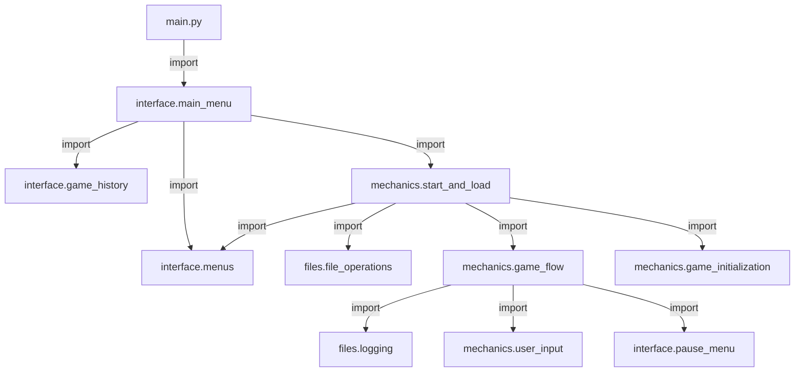

# go-moku

Projeto de jogo Go-moku em python para disciplina de Algoritmos Computacionais da UERJ

```mermaid
graph TD
    A[main.py] -->|import| B[interface.main_menu]

    B -->|import| G[interface.menus]
    B -->|import| F[interface.game_history]
    B -->|import| C[mechanics.start_and_load]

    C -->|import| J[files.file_operations]
    C -->|import| G[interface.menus]
    C -->|import| E[mechanics.game_flow]
    C -->|import| H[mechanics.game_initialization]

    E -->|import| K[files.logging]
    E -->|import| L[mechanics.user_input]
    E -->|import| M[interface.pause_menu]
```
